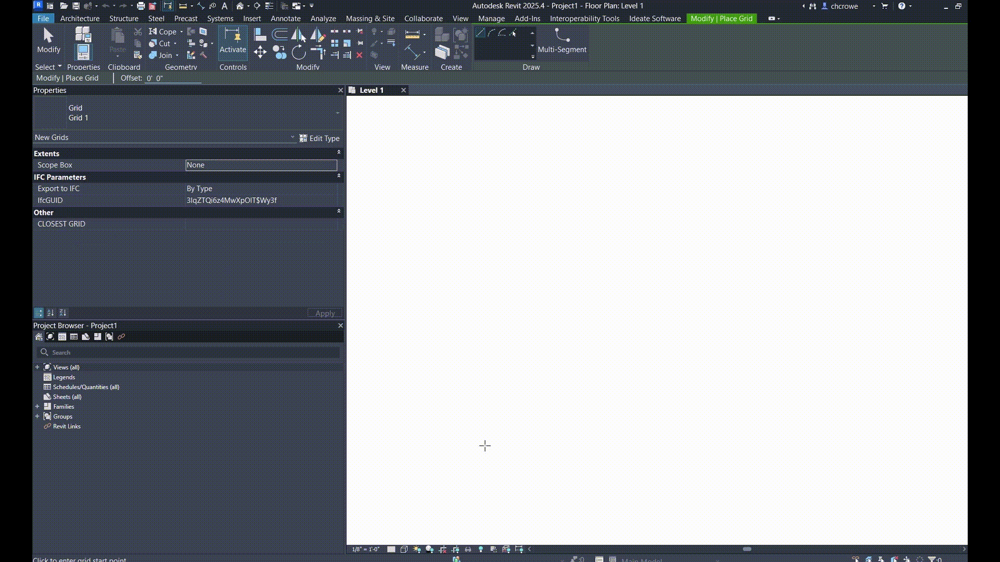

This Revit plugin generates a parameter within models that automatically tracks closest gridline to an object.
Built for easier tracking and organization of model data.
It uses FailuresProcessing and an IUpdater from the Revit API to track which transaction is being interacted with to prevent issues within a the software.
The necessary parameters for this to work will add themselves autoamtically as you work in the project.
All grids are cached so that updates can run quickly and efficiently even on large models.
